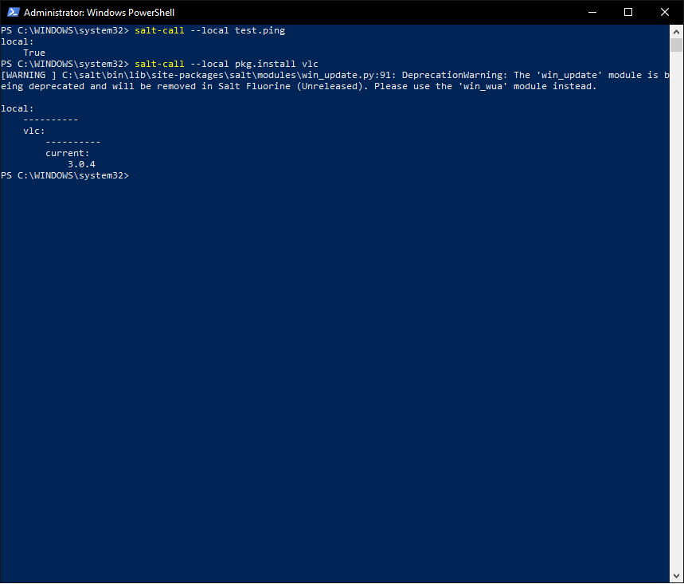

# H5 Configuring Windows settings using SALT 

In this report I'm going to configure some settings from my old laptop and do some actual configurations to make it usable.

## Computer specs

Computer specs from my main PC that is working as the salt-minion.

- OS: Xubuntu 18.04.1 (bootable USB, original OS Windows 10 Professional N)
- CPU: Intel i5 6600k @ 3.5GHz
- GPU: Nvidia Geforce GTX 1070
- RAM: 2x 8Gb DDR4 @ 2667MHz
- MoBo: Asus Maximus VIII Ranger (Boot menu opens with F8)

Computer specs from my old laptop that is working as the salt-master which I booted using [Xubuntu 18.04.1](http://ftp.lysator.liu.se/ubuntu-dvd/xubuntu/releases/18.04/release/)

- product: HP ProBook 655 G1 (E8J42AV)
- OS: Windows 7 Professional (outdated license, which wont renew for some reason)
- CPU: AMD A10-5750M APU with Radeon(tm) HD Graphics @ 2.4Ghz 
- RAM: 1x 8GB DDR3 @ 1600 MHz  

Then I did some personal preference settings, updated my basic packet repositories and had my keyboard layout switched to Finnish.

```bash
setxkbmap fi
sudo apt-get update
```

And cloned my git repository:

```bash
sudo apt-get -y install git
sudo git clone https://github.com/AlfieLinux/salt.git
```

and added my credentials 

```bash
sudo git config --global user.email "tuomas.olkinuora@hotmail.fi"
sudo git config --global user.name "Tuomas Olkinuora"
```


## [A) Configure windows with salt, so that Windows is the slave and Linux is the master.](http://terokarvinen.com/2018/aikataulu-%e2%80%93-palvelinten-hallinta-ict4tn022-3004-ti-ja-3002-to-%e2%80%93-loppukevat-2018-5p) (09:35)

I started by installing the required files for the master-slave relationship to work between my 2 computers. 

The first thing I did was installing git and salt-master on my master computer.

```bash
sudo apt-get -y install salt-master salt-minion
```

I first tried using my salt-master locally and it worked normally. I then checked the version of salt that was installed from the package repo which was "salt 2017.7.4 (Oxygen)". I then installed that version on my windows computer by going to [saltstack repo](https://repo.saltstack.com/windows/) and took the package that used AMD64 architecture and Python 3 "Salt-Minion-2017.7.4-Py3-AMD64-Setup.exe". I applied the information about my masters ip and minions id and got through with the installation.

After having salt-minion installed on my laptop it was time to wait a bit for it to show up on my salt-master. 

But somehow `sudo salt-key -L` or `sudo salt-key` wouldn't list my win7 computer, no matter how long I waited.

So I thought that my firewall might be the cause and allowed both of the salt ports I knew about on the salt-master computer.

```bash
sudo ufw allow 4505/tcp
sudo ufw allow 4506/tcp
```

And checked to see if the keys had showed up

```bash
$ sudo salt-key -L
```
```
$ sudo salt-key
Accepted Keys:
xubuntu
Denied Keys:
Unaccepted Keys:
Rejected Keys:
```

But only the key that I had accepted earlier showed up "xubuntu".

The second thing I tried to do was to updated my salt version by adding the newest package to the repository.

I checked how to do it from [Tero's Guide on how to control Windows using salt](http://terokarvinen.com/2018/control-windows-with-salt)


```bash
$ wget https://repo.saltstack.com/apt/ubuntu/16.04/amd64/latest/SALTSTACK-GPG-KEY.pub
$ sudo apt-key add SALTSTACK-GPG-KEY.pub  # New trust
```

To add the latest version from [saltstack repo](https://repo.saltstack.com/) and a new trust relationship

```bash
$ echo "deb http://repo.saltstack.com/apt/ubuntu/16.04/amd64/2018.3 xenial main"|sudo tee /etc/apt/sources.list.d/saltstack.list
```

Then I updated my package repository and installed the new packages

```bash
$ sudo apt-get update
$ sudo apt-get -y install salt-master salt-minion
$ sudo systemctl restart salt-minion
$ sudo systemctl restart salt-master
```

Restarted both services and tested that they work locally.

```bash
$ hostname -I
192.168.10.50 

$ echo "master: 192.168.10.50"
master: 192.168.10.50

$ echo "master: 192.168.10.50" | sudo tee /etc/salt/minion
master: 192.168.10.50

$ sudo systemctl restart salt-minion.service 

$ sudo salt-key
Accepted Keys:
Denied Keys:
Unaccepted Keys:
xubuntu
Rejected Keys:

$ sudo salt-key -A
The following keys are going to be accepted:
Unaccepted Keys:
xubuntu
Proceed? [n/Y] y
Key for minion xubuntu accepted.

$ sudo salt '*' test.ping
xubuntu:
    True

$ sudo salt '*' cmd.run "whoami"
xubuntu:
    root
```

And it worked like a charm, but locally.

I then tried to install the newest package from saltstack repo by hand on my windows laptop and it once again didn't go without trouble.

My laptop was crying to me about having an old license and since I couldn't find it from anywhere my computer was basically useless. This time it didn't even try to go through the installation but got stuck somewhere for 15 minutes and I decided to give up on it.

### What will I do now? (11:18)

Well since windows and both of my laptops are acting up I decided to boot one of them using Xubuntu and using my bigboi PC with windows as the slave.

I did all the basic configurations once again on my laptop and it ran normally. I used wget to get my script from my repository and to configure my laptop super fast to the way I like it.

```bash
$ wget https://raw.githubusercontent.com/AlfieLinux/salt/master/script/despicable.sh
$ bash despicable.sh
```
The installation went without trouble and I could use salt locally.

```bash
$ sudo salt 'xub*' test.ping
xubuntu:
    True
```

So now for the troubling part

I checked the package version 

```bash
$ salt --version
```

Then I downloaded the same package from the saltstack repo on my windows 2017.17.04 with py3

I then put my laptop ip 192.168.10.61 and the slave name as win10temp. And went through the installation once again.

After the installation I selected the "start salt now" (or whatever the name was) and checked if any unaccepted keys had shown up.

```bash
$ sudo salt-key 
Accepted Keys:
xubuntu
Denied Keys:
Unaccepted Keys:
win10temp
Rejected Keys:
```

And to my surprise there it was, waiting, like a miracle to be accepted.

Now I could actually start configuring some windows settings using salt and even better, try it on my actual computer that I use every day. (Although I'm kinda worried about this).
 
I then tested that the Windows machine actually answers by using test.ping

```bash
$ sudo salt '*' test.ping
xubuntu:
    True
win10temp:
    True
```

and it did, so now its time to move to the next step.

### [Adding package management for windows](http://terokarvinen.com/2018/control-windows-with-salt)

I created a directory for the windows repository package management files and gave it proper permissions

```bash
$ sudo mkdir /srv/salt/win
$ cd /srv/salt/
$ sudo chown root.salt /srv/salt/win/
$ sudo chmod ug+rwx /srv/salt/win/
```

Then I pulled the windows repo package files.

```bash
$ sudo salt-run winrepo.update_git_repos
https://github.com/saltstack/salt-winrepo-ng.git:
    /srv/salt/win/repo-ng/salt-winrepo-ng
https://github.com/saltstack/salt-winrepo.git:
    /srv/salt/win/repo/salt-winrepo
$ sudo salt -G 'os:windows' pkg.refresh_db
win10temp:
    ----------
    failed:
        0
    success:
        260
    total:
        260

$ sudo salt 'win*' pkg.install vlc
win10temp:
    ----------
    vlc:
        ----------
        new:
            3.0.4
        old:
            2.2.3
```

And voilà, I could now use package management on my windows and I when downloading stuff, I only need to trust the software creators.

## [B) Manage windows with salt without using master-slave architecture](http://terokarvinen.com/2018/aikataulu-%e2%80%93-palvelinten-hallinta-ict4tn022-3004-ti-ja-3002-to-%e2%80%93-loppukevat-2018-5p) (11:59)

I started by opening my PowerShell as administrator

By right clicking the PowerShell icon and selecting "run as administrator". I tested that salt works with

```powershell
salt-call --local test.ping
```
Which pinged back true, so I deemed that the local salt-call works. 

I then tried to install something using the salt-call local

```powershell
salt-call --local pkg.install vlc
```

This seemed to work normally since VLC got installed on my computer.



## [C and E) Edit any windows configuration file using salt.](http://terokarvinen.com/2018/aikataulu-%e2%80%93-palvelinten-hallinta-ict4tn022-3004-ti-ja-3002-to-%e2%80%93-loppukevat-2018-5p) (13:15)

I immediatly knew that I wanted to edit some games config file using salt and I landed on my most recently played game called Destiny 2.

I figured out what needed to be done locally from [here](https://www.reddit.com/r/DestinyTechSupport/comments/78jjt6/psa_how_to_change_config_file_custom_framerate/) on my windows computer and tested that the configuration actually worked by launching destiny 2.

Destiny 2 launched normally so I atleast knew that I didn't break anything, now it was just time to see if the bad resolution (1280x720) that I wanted to use actually worked. I didn't need to go further than the character selection screen to see that Things were pretty pixelated but for the sake of actually trying, I launched the game and picked a location to travel to. After landing I could definetly see that destiny 2 had launched using the settings that I applied by looking at the surroundings. 

!('destiny2 1280x720 test.png')
!('destiny 2 1280x720 settings.png')

Now it was time to manage the file using salt, so I started by closing destiny 2 for now.
I dragged the xml file from my windows directory to github, which I then pulled to my Linux computer using 

`sudo git pull`. 

I then created a new folder under /srv/saltsu

`sudo mkdir destconf`

changed directories

`cd destconf`

copied the xml file

`sudo cp /srv/salt/cvars.xml .`

and created a new init.sls file

`sudo nano init.sls`

I started by changing a few lines inside the file specifically 

```xml
		<cvar name="fullscreen_resolution_width" value="1920" />
                <cvar name="fullscreen_resolution_height" value="1080" />
```

I changed the values back to 1920 and 1080 from the earlier 1280 and 720 that I used for the sake of testing. 

Now inside the init.sls file I wrote

```yaml
C:\Users\Tuomas\AppData\Roaming\Bungie\DestinyPC\prefs\cvars
  file.managed:
    - source: salt://destconf/cvars.xml
```

Thinking that it would work that easily.

I then tried to run the state

```bash
$ sudo salt 'win*' state.apply destconf
win10temp:
    Data failed to compile:
----------
    Rendering SLS 'base:destconf' failed: mapping values are not allowed here; line 2

---
C:\Users\Tuomas\AppData\Roaming\Bungie\DestinyPC\prefs\cvars.xml
  file.managed:    <======================
    - source: salt://destconf/cvars.xml 
---
ERROR: Minions returned with non-zero exit code
```

Well as you can see from above, it didn't work. Error message hinted me that something was wrong with the state that I had written, specifically in line 2. This could mean 2 things for me: either the "file.managed:" was poorly written or there was something wrong in the first line I had written. Now since I know that the 2nd line should work I looked in to the first line and noticed that I had missed a single ":" from the end.

I edited the init.sls once again:

`sudoedit init.sls`

```yaml
C:\Users\Tuomas\AppData\Roaming\Bungie\DestinyPC\prefs\cvars.xml:
  file.managed:
    - source: salt://destconf/cvars.xml
```

and now I tried to run the state again

```bash
$ sudo salt "win10temp" state.apply destconf
win10temp:
----------
          ID: C:\Users\Tuomas\AppData\Roaming\Bungie\DestinyPC\prefs\cvars.xml
    Function: file.managed
      Result: True
     Comment: File C:\Users\Tuomas\AppData\Roaming\Bungie\DestinyPC\prefs\cvars.xml updated
     Started: 14:44:30.724674
    Duration: 53.361 ms
     Changes:   
              ----------
              diff:
                  --- 
                  +++ 
                  @@ -24,8 +24,8 @@
                   		<cvar name="atmosphere_lighting_detail" value="1" />
                   		<cvar name="master" value="0" />
                   		<cvar name="framerate_cap_enabled" value="0" />
                  -		<cvar name="fullscreen_resolution_width" value="1280" />
                  -		<cvar name="fullscreen_resolution_height" value="720" />
                  +		<cvar name="fullscreen_resolution_width" value="1920" />
                  +		<cvar name="fullscreen_resolution_height" value="1080" />
                   		<cvar name="fullscreen_refresh_rate_numerator" value="144001" />
                   		<cvar name="fullscreen_refresh_rate_denominator" value="1000" />
                   		<cvar name="windowed_resolution_width" value="1280" />

Summary for win10temp
------------
Succeeded: 1 (changed=1)
Failed:    0
------------
Total states run:     1
Total run time:  53.361 ms
```

Again I didn't need to go further than the character selection screen to notice that my state and the configurations I had made had applied. However I did go further, to the same location where I took the first picture to see that my eyes weren't playing tricks on me. I changed the resolution back to 1280x720 once more, but this time I used the games GUI to do it, instead of editing the config file itself. Ran the state again and it ran flawlessly without errors, and I noticed instantly that it had reverted the changes from 1280x720 to 1920x1080.

!('destiny 2 1920x1080 test.png')
!('destiny 2 1920x1080 settings.png')

```bash
$ sudo salt "win10temp" state.apply destconf
win10temp:
----------
          ID: C:\Users\Tuomas\AppData\Roaming\Bungie\DestinyPC\prefs\cvars.xml
    Function: file.managed
      Result: True
     Comment: File C:\Users\Tuomas\AppData\Roaming\Bungie\DestinyPC\prefs\cvars.xml updated
     Started: 14:53:44.784693
    Duration: 50.863 ms
     Changes:   
              ----------
              diff:
                  --- 
                  +++ 
                  @@ -24,8 +24,8 @@
                   		<cvar name="atmosphere_lighting_detail" value="1" />
                   		<cvar name="master" value="0" />
                   		<cvar name="framerate_cap_enabled" value="0" />
                  -		<cvar name="fullscreen_resolution_width" value="1280" />
                  -		<cvar name="fullscreen_resolution_height" value="720" />
                  +		<cvar name="fullscreen_resolution_width" value="1920" />
                  +		<cvar name="fullscreen_resolution_height" value="1080" />
                   		<cvar name="fullscreen_refresh_rate_numerator" value="144001" />
                   		<cvar name="fullscreen_refresh_rate_denominator" value="1000" />
                   		<cvar name="windowed_resolution_width" value="1280" />

Summary for win10temp
------------
Succeeded: 1 (changed=1)
Failed:    0
------------
Total states run:     1
Total run time:  50.863 ms
```

Now this is something that could be really useful when trying to handle your game configurations. When you e.g let a friend of yours play on your account and they apply some settings that you don't like.  

SOURCES:

[Teros assignments](http://terokarvinen.com/2018/aikataulu-%e2%80%93-palvelinten-hallinta-ict4tn022-3004-ti-ja-3002-to-%e2%80%93-loppukevat-2018-5p)

[Teros guide on how to use salt with windows as a slave and linux as the master](http://terokarvinen.com/2018/control-windows-with-salt)

[saltstack repo for windows](https://repo.saltstack.com/windows/)

[How to edit destiny 2 settings](https://www.reddit.com/r/DestinyTechSupport/comments/78jjt6/psa_how_to_change_config_file_custom_framerate/)
